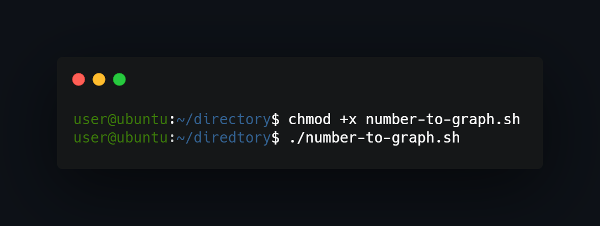

## What project do?
___
This project uses file 'data.txt' to generate horizontal bar chart in terminal.

## How to install?
___
To check out script just run 'number-to-graph.sh' file using ./file in terminal.

## How to use?
___
If you have difficulty showing last record from data file add endline character to file end. If script don't run add execute privillages via chmod command (or try Ubuntu).

<!--https://banner.godori.dev/ height:150-->
<!--https://shields.io/-->
<!--https://carbon.now.sh/-->